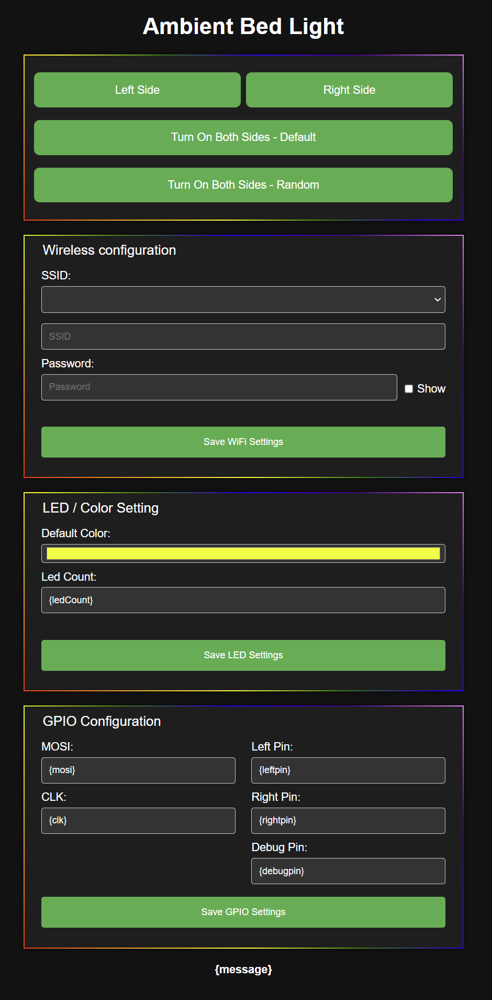

# Bed Ambient Light

Bed Ambient Light is a nanoFramework-based project designed to control an ambient bed light using an ESP32 microcontroller. The project includes features for WiFi configuration, MQTT communication, and LED control.

## Features

- **WiFi Accesspoint**: Easily configure first time setup through WiFi Accesspoint.
- **WiFi Configuration**: Easily configure WiFi settings through a web interface.
- **MQTT Communication**: Connect to an MQTT broker to control the bed light remotely. (not implemented yet)
- **LED Control**: Control the left and right sides of the LED strip independently.
- **LED Settings**: Choose the count and the default color of the night light using a color picker.

## Getting Started

### Prerequisites

- ESP32 microcontroller
- nanoFramework
- Visual Studio 2022
- WiFi network
- MQTT broker (optional)

### Installation

1. Clone the repository:
	```sh
	git clone https://github.com/yourusername/BedLightESP.git
	```
2. Open the project in Visual Studio 2022.
3. Deploy the project to your ESP32 device.

### Configuration

1. **WiFi Configuration**:
    - Access the web interface at `http://<ESP32_IP_ADDRESS>/`.
    - Enter your WiFi SSID and password.
    - Click "Save WiFi Settings".

2. **MQTT Configuration**:
    - Access the web interface at `http://<ESP32_IP_ADDRESS>/`.
    - Enter your MQTT server, port, username, and password.
    - Click "Save MQTT Settings".

3. **Color Selection**:
    - Access the web interface at `http://<ESP32_IP_ADDRESS>/`.
    - Use the color picker to select your desired color.
    - Click "Save Color Settings".

### Usage

- **Control LED Strip**:
    - Use the buttons on the web interface to turn on the left or right side of the LED strip.

### File Structure

- `BedLightESP/`: Main project directory.
- `BedLightESP/Resources/page/`: Contains HTML and CSS files for the web interface.
- `BedLightESP/Settings/`: Contains the settings classes.
- `BedLightESP/Manager/WebManager/`: Contains the web server management classes.
- `BedLightESP/WiFi/`: Contains the WiFi management classes.
- `BedLightESP/MQTT/`: Contains the MQTT management classes.

## WebUI



### Contributing

Contributions are welcome! Please open an issue or submit a pull request for any improvements or bug fixes.

### License

This project is licensed under the GPL-3.0 license. See the [LICENSE](LICENSE) file for details.

### Acknowledgments

- [nanoFramework](https://www.nanoframework.net/) for providing the framework for this project.
- [ESP32](https://www.espressif.com/en/products/socs/esp32) for the hardware platform.
